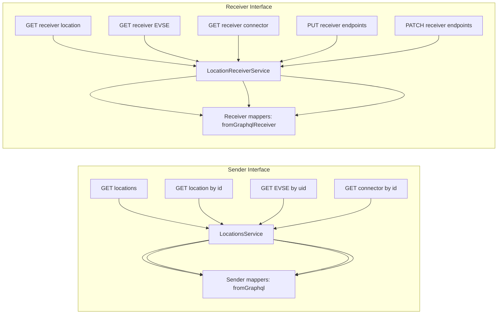

<!-- SPDX-FileCopyrightText: 2025 Contributors to the CitrineOS Project -->
<!--                                                                       -->
<!-- SPDX-License-Identifier: Apache-2.0 -->

# Locations Module (OCPI 2.2.1)

Implementation of the [OCPI 2.2.1 Locations module](https://github.com/ocpi/ocpi/blob/2.2.1/mod_locations.asciidoc).

**Data owner:** CPO (for Sender), partner CPO records (for Receiver)

## Architecture

The Locations module has two separate operational flows based on platform role:

## Endpoints

### Sender Interface

| Method | Path                                              | Description                     |
| ------ | ------------------------------------------------- | ------------------------------- |
| GET    | `/locations`                                      | Paginated list of locations     |
| GET    | `/locations/:location_id`                         | Fetch one location              |
| GET    | `/locations/:location_id/:evse_uid`               | Fetch one EVSE for a location   |
| GET    | `/locations/:location_id/:evse_uid/:connector_id` | Fetch one connector for an EVSE |

### Receiver Interface

| Method | Path                                                                               | Description                               |
| ------ | ---------------------------------------------------------------------------------- | ----------------------------------------- |
| GET    | `/locations/receiver/:country_code/:party_id/:location_id`                         | Retrieve stored partner location          |
| GET    | `/locations/receiver/:country_code/:party_id/:location_id/:evse_uid`               | Retrieve stored partner EVSE              |
| GET    | `/locations/receiver/:country_code/:party_id/:location_id/:evse_uid/:connector_id` | Retrieve stored partner connector         |
| PUT    | `/locations/receiver/:country_code/:party_id/:location_id`                         | Upsert full location from partner CPO     |
| PUT    | `/locations/receiver/:country_code/:party_id/:location_id/:evse_uid`               | Upsert EVSE from partner CPO              |
| PUT    | `/locations/receiver/:country_code/:party_id/:location_id/:evse_uid/:connector_id` | Upsert connector from partner CPO         |
| PATCH  | `/locations/receiver/:country_code/:party_id/:location_id`                         | Partial location update from partner CPO  |
| PATCH  | `/locations/receiver/:country_code/:party_id/:location_id/:evse_uid`               | Partial EVSE update from partner CPO      |
| PATCH  | `/locations/receiver/:country_code/:party_id/:location_id/:evse_uid/:connector_id` | Partial connector update from partner CPO |

## Mapper Design (Critical)

This module intentionally uses **two distinct mapper paths**. They are not interchangeable.

### Sender mapping path

Used by `LocationsService` for Sender GET endpoints:

- `LocationMapper.fromGraphql(...)`
- `EvseMapper.fromGraphql(...)`
- `ConnectorMapper.fromGraphql(...)`

This path maps our own CPO-side records to OCPI output for partner eMSPs.

### Receiver mapping path

Used by `LocationReceiverService` for Receiver GET endpoints:

- `LocationMapper.fromGraphqlReceiver(...)`
- `EvseMapper.fromGraphqlReceiver(...)`
- `ConnectorMapper.fromGraphqlReceiver(...)`

This path maps partner-owned rows (stored with OCPI ids such as `ocpiId` / `ocpiUid`) back to OCPI responses.

> Important: keep these two paths separate when adding fields. If you only update one path, Sender and Receiver responses diverge.

## Service Layer

### `LocationsService` (Sender)

Main responsibilities:

- apply OCPI header and date filters for sender queries
- query location/evse/connector data from GraphQL
- map data with Sender mapper path (`fromGraphql`)
- build OCPI success/error responses

### `LocationReceiverService` (Receiver)

Main responsibilities:

- validate tenant partner authorization for Receiver endpoints
- upsert/persist partner location, EVSE, connector payloads
- perform partial updates for PATCH endpoints
- map responses with Receiver mapper path (`fromGraphqlReceiver`)
- build OCPI success/error responses

## Events and Broadcasting

`LocationsModule` extends `AbstractDtoModule` and handles location/evse/connector insert/update events for broadcasting.

Broadcast safeguards currently rely on ownership checks (for example OCPI ids and owner partner markers) so partner-owned receiver records are not re-broadcast as sender-originated updates.

## Testing

### Unit tests

Target the service and mapper behavior separately:

- `LocationReceiverService` receiver flows and OCPI error handling
- `LocationsService` sender read flows
- `LocationMapper` dual mapping behavior

### Integration scripts

Use curl scripts to validate end-to-end Receiver behavior and persistence:

- `location-test-curls-part-one.sh`
- `location-test-curls-part-two.sh`

Recommended checks:

- full location round-trip
- EVSE/connector PUT and PATCH behavior
- unknown resource handling
- consistency between Receiver GET endpoints and Receiver mapper path
