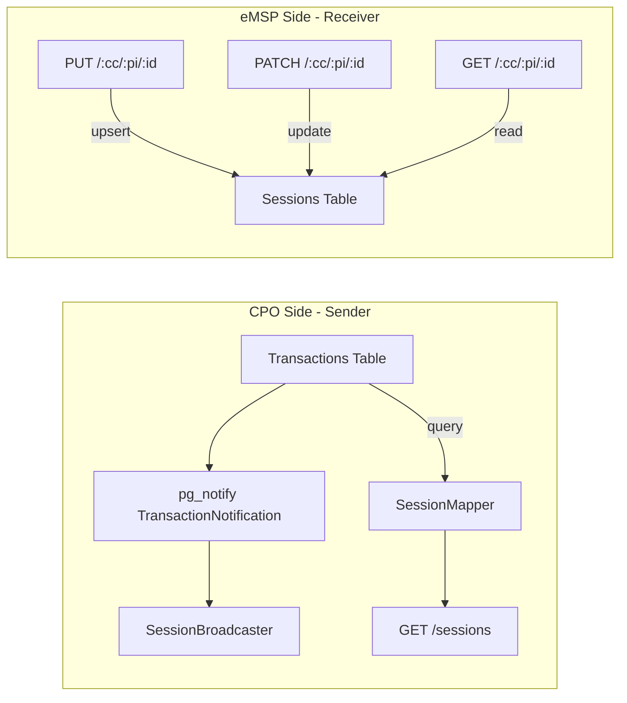

<!-- SPDX-FileCopyrightText: 2025 Contributors to the CitrineOS Project -->
<!--                                                                       -->
<!-- SPDX-License-Identifier: Apache-2.0 -->

# Sessions Module (OCPI 2.2.1)

Implementation of the [OCPI 2.2.1 Sessions module](https://github.com/ocpi/ocpi/blob/2.2.1/mod_sessions.asciidoc).

**Data owner:** CPO

## Architecture

The Sessions module operates in two distinct modes depending on the platform role:



### CPO Role (Sender Interface)

When the platform acts as a CPO, sessions originate from the `Transactions` table (populated by the OCPP stack). The `SessionMapper` constructs OCPI Session objects on-the-fly by joining Transactions with Locations, Tokens, and Tariffs data.

The `SessionBroadcaster` listens to `TransactionNotification` and `MeterValueNotification` events via `pg_notify`, and pushes session updates (PUT/PATCH) to connected eMSP partners.

### eMSP Role (Receiver Interface)

When the platform acts as an eMSP, it receives sessions from partner CPOs via the Receiver endpoints (PUT/PATCH). These are stored in the dedicated `Sessions` table, linked to the partner CPO via `tenantPartnerId`.

## Endpoints

### Sender Interface (CPO)

| Method | Path                                                    | Description                                        |
| ------ | ------------------------------------------------------- | -------------------------------------------------- |
| GET    | `/cpo/2.2.1/sessions`                                   | Paginated list of sessions for the requesting eMSP |
| PUT    | `/cpo/2.2.1/sessions/{session_id}/charging_preferences` | Receive charging preferences from eMSP (mock)      |

### Receiver Interface (eMSP)

| Method | Path                                                          | Description                             |
| ------ | ------------------------------------------------------------- | --------------------------------------- |
| GET    | `/emsp/2.2.1/sessions/{country_code}/{party_id}/{session_id}` | Retrieve a stored session               |
| PUT    | `/emsp/2.2.1/sessions/{country_code}/{party_id}/{session_id}` | Receive new/updated session from CPO    |
| PATCH  | `/emsp/2.2.1/sessions/{country_code}/{party_id}/{session_id}` | Receive partial session update from CPO |

## Data Model

### Sessions Table (eMSP Receiver)

Stores OCPI sessions received from partner CPOs.

| Column                   | Type         | Description                         |
| ------------------------ | ------------ | ----------------------------------- |
| `id`                     | SERIAL PK    | Internal row ID                     |
| `ocpiSessionId`          | VARCHAR(36)  | OCPI session ID                     |
| `countryCode`            | VARCHAR(2)   | CPO's country code                  |
| `partyId`                | VARCHAR(3)   | CPO's party ID                      |
| `startDateTime`          | TIMESTAMPTZ  | Session start                       |
| `endDateTime`            | TIMESTAMPTZ  | Session end (null if active)        |
| `kwh`                    | NUMERIC      | Energy delivered                    |
| `cdrToken`               | JSONB        | CdrToken object                     |
| `authMethod`             | VARCHAR(50)  | Authentication method               |
| `authorizationReference` | VARCHAR(36)  | Optional reference                  |
| `locationId`             | VARCHAR(36)  | Location ID                         |
| `evseUid`                | VARCHAR(36)  | EVSE UID                            |
| `connectorId`            | VARCHAR(36)  | Connector ID                        |
| `meterId`                | VARCHAR(255) | Optional meter ID                   |
| `currency`               | VARCHAR(3)   | ISO 4217 currency code              |
| `chargingPeriods`        | JSONB        | Array of ChargingPeriod             |
| `totalCost`              | JSONB        | Price object                        |
| `status`                 | VARCHAR(20)  | SessionStatus enum                  |
| `lastUpdated`            | TIMESTAMPTZ  | OCPI last_updated                   |
| `tenantId`               | INTEGER FK   | References Tenants                  |
| `tenantPartnerId`        | INTEGER FK   | References TenantPartners (the CPO) |

Unique constraint: `(countryCode, partyId, ocpiSessionId, tenantPartnerId)`

### Transactions Table (CPO Sender)

The existing `Transactions` table (from the OCPP stack) serves as the data source for the Sender interface. Sessions are constructed on-the-fly by `SessionMapper`, which joins data from:

- `Transactions` -- core session data (start/end time, kWh, status)
- `Locations` -- location_id, country_code, party_id
- `Authorizations` -- CdrToken (via `TokensMapper`)
- `Tariffs` -- currency, cost calculation

## Broadcasting

The `SessionsModule` extends `AbstractDtoModule` and handles three event types:

| Event                | Handler                   | Action                                                           |
| -------------------- | ------------------------- | ---------------------------------------------------------------- |
| `Transaction INSERT` | `handleTransactionInsert` | Broadcast PUT session to eMSP partners                           |
| `Transaction UPDATE` | `handleTransactionUpdate` | Broadcast PATCH session; if `isActive=false`, also broadcast CDR |
| `MeterValue INSERT`  | `handleMeterValueInsert`  | Broadcast PATCH session with new charging period                 |

### No Re-Broadcasting Risk

Unlike the Tariffs module (where own and partner tariffs share the same table), Sessions are inherently safe from re-broadcasting:

- The `TransactionNotification` trigger fires only on the `Transactions` table
- Sessions received from partner CPOs are stored in the separate `Sessions` table
- The `Sessions` table has no `pg_notify` trigger
- Therefore, received sessions **never** trigger a broadcast

## Service Layer

`SessionsService` provides:

| Method                                    | Interface      | Description                                  |
| ----------------------------------------- | -------------- | -------------------------------------------- |
| `getSessions(ocpiHeaders, params)`        | Sender GET     | Queries Transactions, maps via SessionMapper |
| `getSessionByOcpiId(cc, pi, id, tpId)`    | Receiver GET   | Queries Sessions table                       |
| `upsertSession(session, tenantId, tpId)`  | Receiver PUT   | Insert or update in Sessions table           |
| `patchSession(cc, pi, id, tpId, partial)` | Receiver PATCH | Partial update in Sessions table             |

## Mapper Layer

| Class                   | Purpose                                                            |
| ----------------------- | ------------------------------------------------------------------ |
| `SessionMapper`         | Maps `TransactionDto` to OCPI `Session` (CPO Sender)               |
| `ReceivedSessionMapper` | Maps between OCPI `Session` and `Sessions` DB rows (eMSP Receiver) |

## Configuration Prerequisites

1. **Apply the migration:**

   ```bash
   npx sequelize-cli db:migrate
   ```

2. **Reload Hasura metadata** so the new `Sessions` table is tracked:

   ```bash
   ./scripts/hasura-reload-metadata.sh
   ```

   Or manually track the table, its columns, and the relationships to `Tenants` and `TenantPartners` via the Hasura console.

3. **Verify** the GraphQL schema exposes `Sessions`, `Sessions_bool_exp`, `Sessions_insert_input`, and `Sessions_set_input`.

## Testing

### Unit Tests

```bash
npx jest --testPathPatterns="ReceivedSessionMapper|SessionsService"
```

### Integration Tests (curl)

```bash
chmod +x sessions-test-curls.sh
./sessions-test-curls.sh
```

The curl script tests both the Receiver interface (PUT/GET/PATCH with a partner CPO) and the Sender interface (paginated GET).
