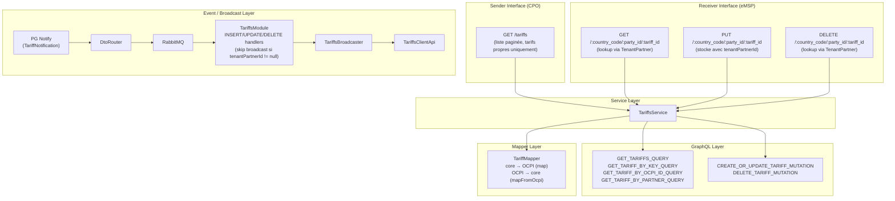

<!-- SPDX-FileCopyrightText: 2025 Contributors to the CitrineOS Project -->
<!--                                                                       -->
<!-- SPDX-License-Identifier: Apache-2.0 -->

# Module Tariffs OCPI 2.2.1 - Documentation technique

## Vue d'ensemble

Le module Tariffs implémente la spécification OCPI 2.2.1 pour la gestion des tarifs de recharge. Il couvre les deux interfaces définies par la norme :

- **Sender Interface (CPO)** : expose les tarifs aux partenaires via un endpoint paginé
- **Receiver Interface (eMSP)** : reçoit, consulte et supprime les tarifs poussés par un CPO

---

## Modèle de données

### Association Tariff - TenantPartner

Chaque tarif est lié à un `Tenant` (notre plateforme) via `tenantId`. De plus, un champ optionnel `tenantPartnerId` permet de tracer l'origine d'un tarif :

- **`tenantPartnerId = NULL`** : tarif propre (nous sommes CPO et possédons ce tarif)
- **`tenantPartnerId = <id>`** : tarif reçu d'un partenaire CPO identifié par ce `TenantPartner`

Cette distinction est essentielle pour :

1. **Filtrage Sender** : le `GET /tariffs` (Sender Interface) ne retourne que les tarifs propres (`tenantPartnerId IS NULL`)
2. **Filtrage Receiver** : le `GET /:cc/:pid/:tid` (Receiver Interface) retrouve un tarif par les identifiants du CPO partenaire (`TenantPartner.countryCode`/`TenantPartner.partyId`)
3. **Broadcasting** : seuls les tarifs propres sont broadcastés aux partenaires eMSP ; les tarifs reçus d'un CPO ne sont jamais re-broadcastés

### Migration

Fichier : `migrations/20250730123508_add_tenant_partner_id_to_tariffs.ts`

Ajoute :

- Colonne `tenantPartnerId INTEGER NULL REFERENCES "TenantPartners"(id) ON DELETE SET NULL`
- Index `idx_tariffs_tenant_partner_id`

Après exécution de la migration, il faut tracker dans Hasura :

1. La nouvelle colonne `tenantPartnerId` de la table `Tariffs`
2. La relation objet `TenantPartner` (via `tenantPartnerId` → `TenantPartners.id`)
3. Ajouter `tenantPartnerId` et la relation `TenantPartner` aux permissions select/insert/update

---

## Architecture



---

## Endpoints API

### Sender Interface (CPO)

| Méthode | Route                 | Description                                                                                                              |
| ------- | --------------------- | ------------------------------------------------------------------------------------------------------------------------ |
| `GET`   | `/:versionId/tariffs` | Liste paginée des tarifs propres du CPO (`tenantPartnerId IS NULL`). Supporte `date_from`, `date_to`, `offset`, `limit`. |

### Receiver Interface (eMSP)

Les `country_code`/`party_id` dans l'URL identifient le CPO source (l'émetteur du tarif), conformément à la spécification OCPI 2.2.1.

| Méthode  | Route                                                    | Description                                                                                                                                                                         |
| -------- | -------------------------------------------------------- | ----------------------------------------------------------------------------------------------------------------------------------------------------------------------------------- |
| `GET`    | `/:versionId/tariffs/:country_code/:party_id/:tariff_id` | Récupère un tarif stocké localement, identifié par les identifiants du CPO source (`TenantPartner.countryCode`/`partyId`). Retourne `404` si non trouvé.                            |
| `PUT`    | `/:versionId/tariffs/:country_code/:party_id/:tariff_id` | Crée ou met à jour un tarif reçu d'un CPO. Stocke le `tenantPartnerId` issu du contexte d'authentification. Les `country_code`/`party_id`/`tariff_id` de l'URL priment sur le body. |
| `DELETE` | `/:versionId/tariffs/:country_code/:party_id/:tariff_id` | Supprime un tarif identifié par les identifiants du CPO source. Retourne une erreur si le tarif n'existe pas.                                                                       |

---

## Fichiers et responsabilités

### Controller

**`03_Modules/Tariffs/src/module/TariffsModuleApi.ts`**

Contrôleur principal enregistré sur `/:versionId/tariffs`. Implémente `ITariffsModuleApi`. Méthodes :

- `getTariffs()` — Sender GET paginé avec `@Paginated()`, `@FunctionalEndpointParams()`
- `getTariffById()` — Receiver GET, lookup via `TenantPartner` (`isPartnerLookup = true`)
- `putTariff()` — Receiver PUT, extrait `tenantId` et `tenantPartnerId` du contexte, délègue à `TariffsService.createOrUpdateTariff()`
- `deleteTariff()` — Receiver DELETE, lookup via `TenantPartner` (`isPartnerLookup = true`), retourne `OcpiEmptyResponse`

### Interface

**`03_Modules/Tariffs/src/module/ITariffsModuleApi.ts`**

Contrat TypeScript définissant les signatures de `getTariffs`, `getTariffById`, `putTariff` et `deleteTariff`.

### Service

**`00_Base/src/services/TariffsService.ts`**

Couche métier injectée via `typedi`. Méthodes :

| Méthode                                                               | Description                                                                                                                                                  |
| --------------------------------------------------------------------- | ------------------------------------------------------------------------------------------------------------------------------------------------------------ |
| `getTariffByKey({ id, countryCode, partyId })`                        | Lookup par clé interne (id int + tenant). Utilisé en interne et par le broadcaster.                                                                          |
| `getTariffByOcpiId(countryCode, partyId, tariffId, isPartnerLookup?)` | Lookup par identifiants OCPI. Si `isPartnerLookup = true`, filtre via `TenantPartner` au lieu de `Tenant`. Utilisé par les endpoints Receiver GET et DELETE. |
| `getTariffs(ocpiHeaders, paginationParams?)`                          | Liste paginée avec filtres `date_from`/`date_to` sur `updatedAt`. Exclut les tarifs reçus (`tenantPartnerId IS NULL`).                                       |
| `createOrUpdateTariff(tariffRequest, tenantId?, tenantPartnerId?)`    | Upsert via `CREATE_OR_UPDATE_TARIFF_MUTATION`. Convertit le DTO OCPI en modèle core via `TariffMapper.mapFromOcpi()`, incluant `tenantPartnerId` si fourni.  |
| `deleteTariff(countryCode, partyId, tariffId, isPartnerLookup?)`      | Vérifie l'existence du tarif (via Tenant ou TenantPartner selon `isPartnerLookup`) puis le supprime. Lance une erreur si non trouvé.                         |

### Mapper

**`00_Base/src/mapper/TariffMapper.ts`**

Classe statique de conversion bidirectionnelle :

| Méthode                                            | Direction             | Description                                                                                                                                                                        |
| -------------------------------------------------- | --------------------- | ---------------------------------------------------------------------------------------------------------------------------------------------------------------------------------- |
| `map(coreTariff)`                                  | Core → OCPI           | Convertit un `TariffDto` interne en `TariffDTO` OCPI. Construit les `TariffElement` à partir de `pricePerKwh`, `pricePerMin`, `pricePerSession`. Mappe `tariffAltText` si présent. |
| `mapElementsToCoreTariff(elements)`                | OCPI → Core (partiel) | Extrait `pricePerKwh`, `pricePerMin`, `pricePerSession`, `taxRate` depuis les `PriceComponent` d'un `TariffElement`.                                                               |
| `mapFromOcpi(tariff, tenantId?, tenantPartnerId?)` | OCPI → Core           | Conversion complète d'un `PutTariffRequest` OCPI en `Partial<TariffDto>` core. Inclut `tenantId` et `tenantPartnerId` si fournis.                                                  |

### GraphQL

**`00_Base/src/graphql/queries/tariff.queries.ts`**

| Constante                          | Type     | Description                                                                                              |
| ---------------------------------- | -------- | -------------------------------------------------------------------------------------------------------- |
| `GET_TARIFF_BY_KEY_QUERY`          | Query    | Lookup par `id` (int) + tenant `countryCode`/`partyId`.                                                  |
| `GET_TARIFFS_QUERY`                | Query    | Liste paginée avec filtre `where` sur `updatedAt`, tenant, et `tenantPartnerId`.                         |
| `GET_TARIFF_BY_OCPI_ID_QUERY`      | Query    | Lookup par `tariffId` (int) + tenant. Utilisé pour les tarifs propres.                                   |
| `GET_TARIFF_BY_PARTNER_QUERY`      | Query    | Lookup par `tariffId` (int) + `TenantPartner.countryCode`/`partyId`. Utilisé par les endpoints Receiver. |
| `CREATE_OR_UPDATE_TARIFF_MUTATION` | Mutation | Upsert avec `on_conflict` sur `Tariffs_pkey`. Met à jour tous les champs de pricing + `tenantPartnerId`. |
| `DELETE_TARIFF_MUTATION`           | Mutation | Suppression par `id` (clé primaire).                                                                     |

**`00_Base/src/graphql/operations.ts`**

Types TypeScript correspondants incluant `tenantPartnerId` dans tous les résultats et le support `TenantPartner` dans `Tariffs_Bool_Exp`.

### Broadcaster

**`00_Base/src/broadcaster/TariffsBroadcaster.ts`**

Diffuse les changements de tarifs vers les partenaires via `TariffsClientApi` :

- `broadcastPutTariff(tenant, tariffDto)` — Récupère les champs manquants via GraphQL si besoin, mappe en OCPI, puis envoie un PUT à tous les partenaires Receiver.
- `broadcastTariffDeletion(tenant, tariffDto)` — Envoie un DELETE à tous les partenaires Receiver.

### Event Handlers

**`03_Modules/Tariffs/src/index.ts`**

Le module `TariffsModule` écoute les notifications PostgreSQL `TariffNotification` via RabbitMQ et déclenche les broadcasts **uniquement pour les tarifs propres** :

| Event    | Handler              | Action                                                                                               |
| -------- | -------------------- | ---------------------------------------------------------------------------------------------------- |
| `INSERT` | `handleTariffInsert` | Si `tenantPartnerId` est null → `broadcastPutTariff`. Sinon, skip (tarif reçu d'un partenaire).      |
| `UPDATE` | `handleTariffUpdate` | Si `tenantPartnerId` est null → `broadcastPutTariff`. Sinon, skip (tarif reçu d'un partenaire).      |
| `DELETE` | `handleTariffDelete` | Si `tenantPartnerId` est null → `broadcastTariffDeletion`. Sinon, skip (tarif reçu d'un partenaire). |

### Client API

**`00_Base/src/trigger/TariffsClientApi.ts`**

Client HTTP sortant pour appeler les endpoints OCPI Tariffs des partenaires :

- `getTariff(countryCode, partyId, tariffId)` — GET sur le Receiver partenaire
- `putTariff(countryCode, partyId, tariffId, tariff)` — PUT sur le Receiver partenaire
- `deleteTariff(countryCode, partyId, tariffId)` — DELETE sur le Receiver partenaire

### Modèles de données

| Fichier                                             | Description                                                                                         |
| --------------------------------------------------- | --------------------------------------------------------------------------------------------------- |
| `00_Base/src/model/Tariff.ts`                       | Schéma Zod `TariffSchema` complet OCPI (id, country_code, party_id, currency, type, elements, etc.) |
| `00_Base/src/model/DTO/tariffs/TariffDTO.ts`        | DTO de sortie avec `last_updated`. Schéma paginé `PaginatedTariffResponseSchema`.                   |
| `00_Base/src/model/DTO/tariffs/PutTariffRequest.ts` | DTO d'entrée pour le PUT (sans `last_updated`).                                                     |
| `00_Base/src/model/TariffElement.ts`                | `TariffElementSchema` : `price_components` + `restrictions`                                         |
| `00_Base/src/model/TariffRestrictions.ts`           | Restrictions horaires, jour, kWh, durée, puissance                                                  |
| `00_Base/src/model/TariffDimensionType.ts`          | Enum : `ENERGY`, `FLAT`, `PARKING_TIME`, `TIME`                                                     |
| `00_Base/src/model/TariffType.ts`                   | Enum : `AD_HOC_PAYMENT`, `PROFILE_CHEAP`, `PROFILE_FAST`, `PROFILE_GREEN`, `REGULAR`                |

---

## Tests

### Lancer les tests

```bash
nvm use 20
npx jest --config jest.config.cjs --testPathPatterns="Tariff"
```

### Fichiers de test

| Fichier                                                 | Couverture                                                                                                                                                                                              |
| ------------------------------------------------------- | ------------------------------------------------------------------------------------------------------------------------------------------------------------------------------------------------------- |
| `00_Base/src/mapper/__tests__/TariffMapper.test.ts`     | `map()` (core→OCPI), `mapElementsToCoreTariff()`, `mapFromOcpi()` (OCPI→core avec tenantPartnerId), round-trip                                                                                          |
| `00_Base/src/services/__tests__/TariffsService.test.ts` | `getTariffByKey`, `getTariffByOcpiId` (tenant et partner lookup), `getTariffs` (filtre tenantPartnerId IS NULL), `createOrUpdateTariff` (avec/sans tenantPartnerId), `deleteTariff` (tenant et partner) |

### Configuration Jest

`jest.config.cjs` :

- `setupFiles: ['reflect-metadata']` — requis pour les décorateurs
- `moduleNameMapper: { '\.js$' → '' }` — redirige les imports ESM `.js` vers les `.ts`
- `transformIgnorePatterns` — transforme `@citrineos/*` (packages ESM dans node_modules)
- Override tsconfig : `verbatimModuleSyntax: false`, `module: commonjs`

---

## Flux de données

### Pull model (eMSP interroge le CPO)

```
eMSP  →  GET /tariffs?date_from=...&limit=50  →  CPO
eMSP  ←  PaginatedTariffResponse { data: TariffDTO[], total, offset, limit }
         (uniquement les tarifs propres du CPO, tenantPartnerId IS NULL)
```

### Push model (CPO pousse vers l'eMSP)

```
[DB] INSERT/UPDATE Tariffs (tenantPartnerId IS NULL)
    →  PG NOTIFY TariffNotification (inclut tenantPartnerId dans le payload)
    →  DtoRouter → RabbitMQ
    →  TariffsModule.handleTariffInsert/Update
    →  Vérifie tenantPartnerId == null → OUI
    →  TariffsBroadcaster.broadcastPutTariff
    →  TariffsClientApi.putTariff  →  eMSP PUT /:cc/:pid/:tid
```

```
[DB] INSERT/UPDATE Tariffs (tenantPartnerId != NULL)
    →  PG NOTIFY TariffNotification
    →  DtoRouter → RabbitMQ
    →  TariffsModule.handleTariffInsert/Update
    →  Vérifie tenantPartnerId == null → NON
    →  Skip broadcast (tarif reçu d'un partenaire CPO)
```

```
[DB] DELETE Tariffs (tenantPartnerId IS NULL)
    →  PG NOTIFY TariffNotification
    →  DtoRouter → RabbitMQ
    →  TariffsModule.handleTariffDelete
    →  Vérifie tenantPartnerId == null → OUI
    →  TariffsBroadcaster.broadcastTariffDeletion
    →  TariffsClientApi.deleteTariff  →  eMSP DELETE /:cc/:pid/:tid
```

### Receiver (eMSP reçoit du CPO)

```
CPO  →  PUT /:versionId/tariffs/:cc/:pid/:tid  →  TariffsModuleApi.putTariff
     →  Extrait tenantId et tenantPartnerId du contexte d'authentification
     →  TariffsService.createOrUpdateTariff(request, tenantId, tenantPartnerId)
     →  TariffMapper.mapFromOcpi → GraphQL upsert (avec tenantPartnerId) → TariffMapper.map
     →  OcpiResponse { data: TariffDTO }
```

```
CPO  →  DELETE /:versionId/tariffs/:cc/:pid/:tid  →  TariffsModuleApi.deleteTariff
     →  TariffsService.deleteTariff(cc, pid, tid, isPartnerLookup=true)
     →  Lookup via TenantPartner → GraphQL delete
     →  OcpiEmptyResponse
```
